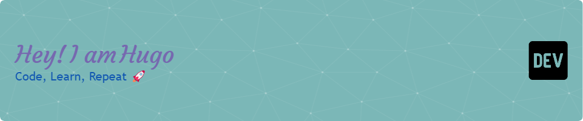

<h1 align="center"><b>Hi , I'm Hugo Almodóvar Fuster </b></h1>

 

## 💫About me
- 🎓 2nd-year DAM student
- 💻 Passionate about programming and multiplatform development
- ⚡ Enthusiast in Java, C#, and SQL
- 📱 Always exploring new technologies and tools

## <b> Skills</b>

- **Languages**:
    
    
    
    
  
    
    
- **Front-End Development**:

  
  
  
  
  

 

- **Database**:

   
   
   
 

 

- **Softwares and Tools**:

  
  
  
  
  
  
  
  
    

 

- **Extras**:

  
  
  

## <b> Github Stats </b>
 

## <b>🤝🏻 Let's Connect..!</b>

 

	

***

